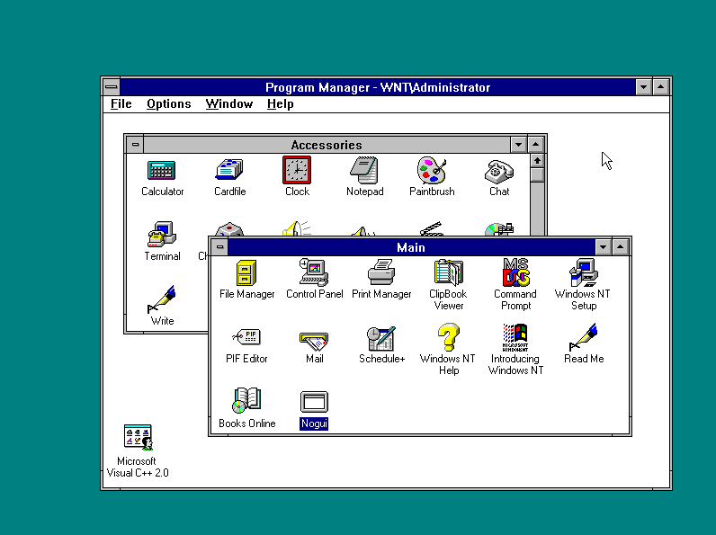

# DOOM fire effect in C#

This is the DOOM fire effect with no dependencies on standard GUI frameworks. Calls into Win32 APIs directly.

This is not idiomatic C# GUI code, but mostly a hack. No sane person writes C# GUI apps like this.

Can be compiled with CoreRT to generate a ~8 kB fully self-contained executable.

To publish with CoreRT simply run the following line from the root of the repo:

```
dotnet publish -r win-x64 -c Release /p:UseCoreRT=true
```

The main objective of this was to get this code running on Windows NT 3.51:



Mission accomplished.
